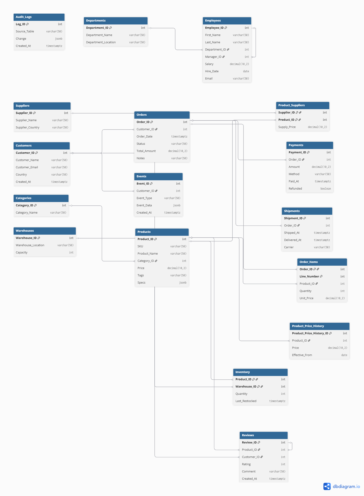

# SQL Portfolio: 105 Problems from Basics to Production-Ready Queries


A comprehensive SQL learning resource built around a realistic e-commerce database with 15+ interconnected tables. This repository demonstrates SQL proficiency from foundational queries to advanced database optimization techniques used in production environments.

---

## 🎯 Project Overview

**What This Is:**  
A self-designed PostgreSQL database and 105 progressively challenging SQL problems that mirror real-world business scenarios. Each problem includes detailed solutions with explanatory comments.

**Built For:**
- Data Analysts preparing for technical interviews
- SQL learners progressing from basics to advanced concepts
- Developers wanting to understand production database patterns
- Anyone needing a practical SQL reference with business context

---

## 📊 Database Schema

The database models a complete e-commerce operation with:

- **Customer Management**: Customers, Reviews, Events (JSONB user actions)
- **Product Catalog**: Products (with JSONB specs), Categories, Suppliers
- **Order Lifecycle**: Orders, Order_Items, Payments (split payments), Shipments
- **Inventory**: Warehouses, Inventory tracking with restock timestamps
- **Organizational**: Departments, Employees (self-referential manager hierarchy)
- **Auditing**: Audit_Logs (JSONB change tracking), Product_Price_History

**Total Tables**: 15 with realistic constraints, foreign keys, and indexes

### Entity Relationship Diagram



*Complete schema with all relationships, constraints, and data types*

👉 **[View Detailed Schema Documentation](./00-Database-Schema/schema.sql)**

---

## 📚 Problem Categories

### **Basics (B1-B35)** - Foundations
Core SQL operations every analyst needs:
- SELECT, WHERE, filtering and sorting
- Aggregations (COUNT, SUM, AVG, MIN, MAX)
- JOINs (INNER, LEFT, identifying orphaned records)
- GROUP BY with HAVING
- Subqueries and CASE statements
- Date/time operations and COALESCE
- Basic data manipulation (INSERT, UPDATE, DELETE)

**Example Problems:**
- *B15*: Find customers who never placed an order (LEFT JOIN + NULL filtering)
- *B23*: Products priced above average (subquery pattern)
- *B26*: Orders in last 90 days (interval arithmetic)

---

### **Intermediate (I1-I35)** - Business Logic
Real-world analytical queries and optimizations:
- CTEs (Common Table Expressions) for complex logic
- Window functions (LAG, LEAD, RANK, RUNNING totals)
- JSONB operations and indexing strategies
- Advanced aggregations (FILTER, STRING_AGG, ARRAY_AGG)
- Index creation and query performance (EXPLAIN ANALYZE)
- Transactions and UPSERT patterns
- Materialized views for reporting

**Example Problems:**
- *I11*: Month-over-month revenue growth with percentage change
- *I16*: Safe transaction with rollback on error
- *I24*: Cumulative payment tracking per order (window aggregates)
- *I33*: Safely delete duplicates using ROW_NUMBER()

---

### **Advanced (A1-A35)** - Production Patterns
Enterprise-level database engineering:
- Recursive CTEs (organizational hierarchies, sessionization)
- Advanced indexing (BRIN, GIN, partial, covering indexes)
- Query optimization and parallel execution
- PL/pgSQL stored procedures and triggers
- Row-level security and audit logging
- Partitioning strategies and reindexing
- Deadlock prevention and concurrency control
- Multi-master conflict resolution concepts

**Example Problems:**
- *A2*: Recursive employee reporting chain (manager hierarchies)
- *A7*: User sessionization with 30-minute gap detection
- *A18*: Inventory reduction trigger with stock validation
- *A25*: Audit trigger capturing row-level changes to JSONB
- *A34*: Zero-downtime column migration pattern

---

## 💼 Business Applications

These problems solve real business questions across multiple domains:

### **Customer Analytics** 
- Lifetime value (LTV) calculation
- Cohort analysis and retention
- Customer segmentation by spending
- Churn identification and prevention

### **Inventory & Operations**
- Stock level monitoring across warehouses
- Restock scheduling based on sales velocity
- Supplier performance analysis
- Shipment tracking and delivery SLAs

### **Revenue Analysis**
- Monthly/quarterly revenue trends
- Product performance ranking
- Payment reconciliation and refund tracking
- Revenue forecasting with rolling averages

### **Performance Optimization**
- Index strategy for faster queries
- Query execution plan analysis
- Materialized view refresh patterns
- Safe bulk operations on large tables

👉 **[See Detailed Business Use Cases](./04-Business-Applications/)**

---

## 🚀 How to Use This Repository

### **For Learning:**
1. Start with `/01-Basics/` and work through sequentially
2. Try solving each problem before viewing solutions
3. Run queries against the provided schema
4. Read inline comments explaining the "why" behind each solution

**Example: Customer Spending Analysis**
```sql
SELECT 
    c.customer_name,
    COUNT(o.order_id) AS total_orders,
    SUM(o.total_amount) AS total_spent
FROM customers c
LEFT JOIN orders o ON c.customer_id = o.customer_id
GROUP BY c.customer_id, c.customer_name
ORDER BY total_spent DESC NULLS LAST
LIMIT 5;
```

*Top 5 customers by spending - actual output from the database* c:\Users\Success\Pictures\Screenshots\Screenshot 2025-11-02 084330.png


### **For Interview Prep:**
1. Review problem categories matching your target role
2. Practice explaining solutions out loud
3. Focus on `/03-Advanced/` for senior positions
4. Use business applications section for behavioral interview stories

### **For Portfolio/Resume:**
- Reference specific advanced problems in interviews ("I built a recursive CTE for employee hierarchies")
- Demonstrate understanding of production concepts (indexing, triggers, transactions)
- Show progression from basics to complex real-world patterns

---

## 🛠 Technical Highlights

**PostgreSQL-Specific Features:**
- `DISTINCT ON` for efficient deduplication
- `FILTER` clause in aggregations
- `LATERAL` joins for correlated subqueries
- `JSONB` operations with GIN indexing
- `ARRAY` data types and operations
- Recursive CTEs with cycle detection
- Trigram fuzzy matching (`pg_trgm`)

**Best Practices Demonstrated:**
- Idempotent UPSERT patterns (`ON CONFLICT`)
- Safe concurrent index creation
- Transaction isolation and rollback handling
- Optimistic concurrency control
- Query performance analysis with `EXPLAIN ANALYZE`
- Keyset pagination (seek method)
- Data type migrations with minimal downtime

---

## 📖 Getting Started

### **Prerequisites:**
- PostgreSQL 15+ installed
- Basic SQL knowledge (for Basics section)
- psql or any PostgreSQL client

### **Setup:**
```bash
# Clone the repository
git clone https://github.com/LennySHumphrey/SQL-Portfolio-105-Problems.git
cd SQL-Portfolio-105-Problems

# Create your database and load schema
psql -U your_username -d postgres
CREATE DATABASE ecommerce_practice;
\c ecommerce_practice
\i 00-Database-Schema/schema.sql

# Start with basics
\i 01-Basics/basics-problems.sql
```

---

## 📈 Learning Path Recommendation

**Week 1-2: Foundations**  
Complete all 35 Basics problems. Focus on understanding JOIN logic and aggregations.

**Week 3-4: Analytical Queries**  
Tackle Intermediate section. Master CTEs and window functions.

**Week 5-6: Advanced Concepts**  
Work through Advanced problems. Study each solution's comments on *why* certain patterns are used.

**Week 7: Portfolio Integration**  
Map problems to business applications. Practice explaining solutions in plain English.

---

## 🤝 About This Project

Created as a comprehensive SQL learning resource and technical portfolio piece. The database schema and all 105 problems were designed from scratch to provide:
- **Realistic complexity**: Multiple foreign keys, JSONB fields, timestamp tracking
- **Progressive difficulty**: Each section builds on previous concepts
- **Business relevance**: Every query solves actual analytical questions
- **Production patterns**: Includes triggers, procedures, indexing strategies used in real systems

---

## 📬 Contact & Feedback

**Your Name**  
📧 humphreysuccess4@gmail.com 
💼 [LinkedIn](https://www.linkedin.com/in/lenny-humphrey-73217b339)
🔗 [Portfolio](in the works)

---

## 📝 License

This project is open source and available for educational purposes. Feel free to use it for learning, but please provide attribution if you reference or fork this work.

---

**⭐ If you find this helpful, please star the repository!**